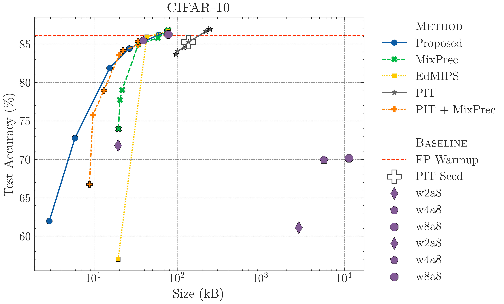
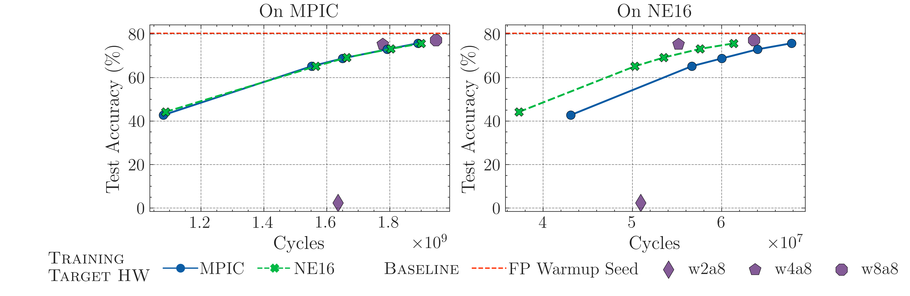

# Joint Pruning and Mixed-Precision Quantization
This repository contains code to perform jointly mixed-precision quantization and pruning.

For this project the cost models of MPIC and the NE16 DNN accelerator have been used and are located in the `hardware_models` folder.

# Key results

## Size regularizer - CIFAR-10
We report below the results on the CIFAR-10 benchmark, when employ the hardware-agnostic size regularizer. We compare with various state-of-the-art approaches, and with the sequential application of a pruning algorithm (PIT) and a channel-wise mixed-precision quantization technique (denoted as "MixPrec" in the plot).

## MPIC and NE16 deployment results
We have evaluated our approach on CIFAR-10 with the MPIC and NE16 hardware cost models. We then evaluated the obtained architecture on both hardware, to assess the importance of a well-tailored cost models during training to obtain good architectures.

    

## Scaling to larger benchmarks and datasets
We have also considered the ImageNet dataset to assess the behavior of the algorithm for large models. We adopted the same training protocol and quantization schemes used in the other experiments of our manuscript (note that the results could be improved by exploring more advanced quantization algorithms and training hyperparameters, which are fully orthogonal to our optimization method).

    

Our proposed algorithm was able to obtain a Pareto front of architectures in the accuracy vs. number of inference cycles space, surpassing the fixed-precision baselines, especially in the low cycles regime. These results confirmed that our method can still work for larger-scale datasets and models.

Morevoer, it is possible to see how, as expected, well-tailored hardware cost models have a stronger impact when the optimization is applied to tiny neural networks. This happens because the relative impact of a non-ideal precision assignment is lower when the layer's size increases.
